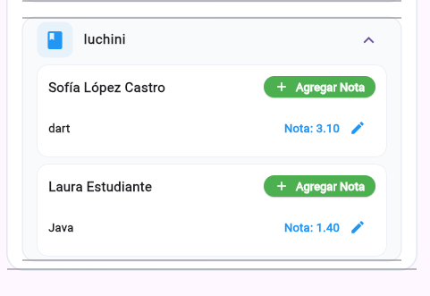
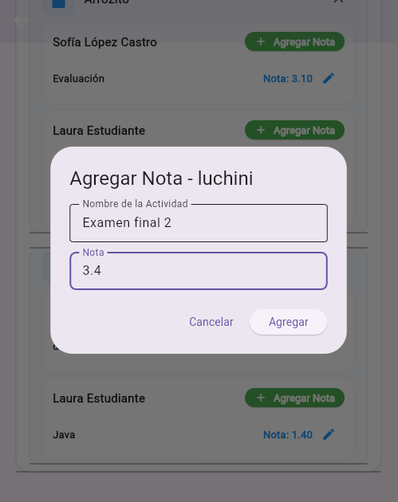
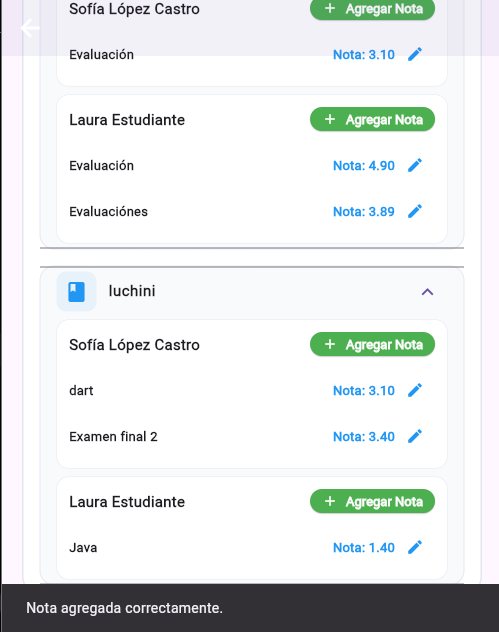
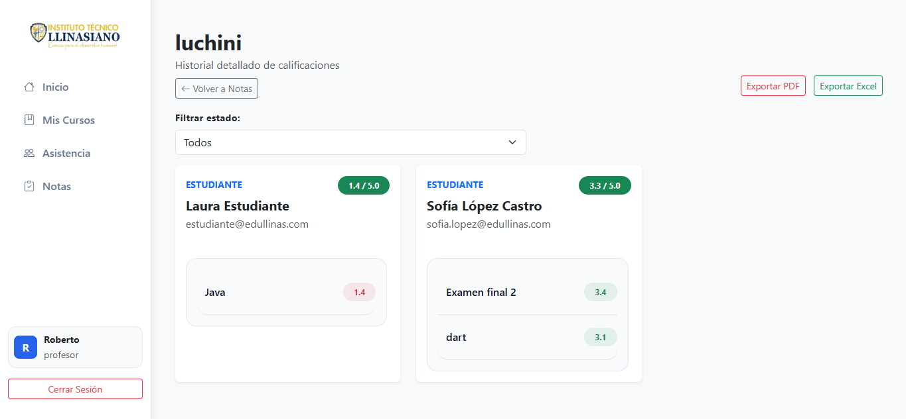

# 🎓 Edullinas

**Sistema Integral de Gestión Académica** para instituciones educativas.

Plataforma completa que permite gestionar estudiantes, profesores, asistencias, notas, cursos y módulos de manera eficiente.

## ✨ Características Principales

### 👨‍💼 **Panel de Administración**
- Gestión completa de usuarios (Activos / Inactivos)
- Activación y desactivación de cuentas
- Asignación de roles
- Visualización de asistencias e inasistencias por curso y módulo

### 👨‍🏫 **Panel de Profesores**
- Registro de asistencias
- Gestión de notas por módulo y actividad
- Visualización de módulos asignados
- Bloqueo automático de módulos finalizados

### 👩‍🎓 **Panel de Estudiantes**
- Visualización de su curso y progreso
- Consulta de asistencias personales
- Revisión de notas y promedio por módulo
- Contador de módulos completados

### 📊 **Otras Funcionalidades**
- Sistema de roles (Admin, Coordinación, Profesor, Estudiante)
- Reportes detallados de asistencia y rendimiento
- Exportación de historial de notas (PDF y Excel)
- Fechas automáticas de finalización de módulos

## 🛠 Tecnologías Utilizadas

| Capa              | Tecnología                          |
|-------------------|-------------------------------------|
| **Backend**       | Python + Flask                      |
| **Base de Datos** | MySQL                               |
| **Frontend Web**  | HTML5, Bootstrap 5, JavaScript      |
| **App Móvil**     | Flutter + Dart                      |
| **Autenticación** | Sesiones + Hashing (SHA-256)        |

## 📁 Estructura del Proyecto

edullinas/
├── backend/                # Flask + Python
├── frontend-templates/     # HTML + JS + Bootstrap
├── app/                    # Aplicación móvil
├── db/                     # base de datos  MYSQL
├── web/                    # Documentación
└── README.md

## 🤝 Contribuir
Las contribuciones son bienvenidas. Si deseas mejorar el proyecto:

1. Haz un Fork
2. Crea una rama (git checkout -b feature/nueva-funcionalidad)
3. Realiza tus cambios  
4. Envía un Pull Request

## 📌 Evidencia de Funcionalidad - Integración Flutter + Web

**Evidencia entregada a:** [Henry Guzman]  
**Fecha de entrega:** 25 de junio de 2026  
**Versión del Proyecto:** v2.3.0

---

### 🎯 **Objetivo de la Evidencia:**
Demostrar que la **aplicación móvil (Flutter)** y la **plataforma web** están correctamente conectadas y sincronizadas en tiempo real a través del Backend.

### 📸 Capturas de Pantalla

#### 1. Vista de Notas del Profesor en la App Flutter

#### 2. Agregando una nueva nota desde la App Flutter

#### 3. Nota guardada correctamente + Visualización en la Plataforma Web

---

**Descripción de la prueba:**

- Se accedió al módulo correspondiente desde la **App Flutter**.
- Se registró una nueva calificación para un estudiante.
- La nota se guardó correctamente en la base de datos.
- Al refrescar la **plataforma web** (vista de Profesor), la nota aparece inmediatamente.

Esto confirma la **integración completa** entre la aplicación móvil y la versión web del sistema.

---

**Realizado por:** [Said Marquez]  
**Fecha:** 25 de junio de 2026
